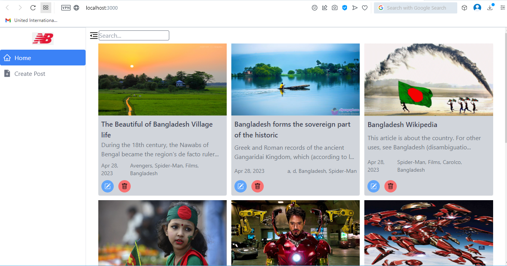
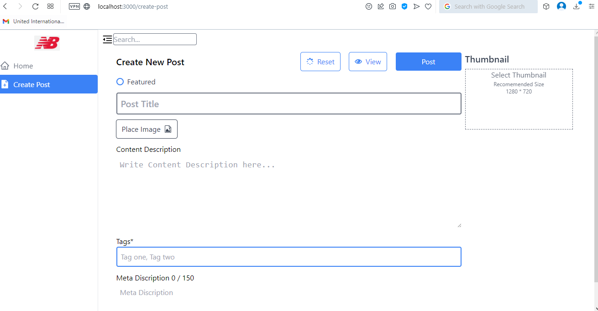

<h2 align="center">🔑Wikipeadia Mobile App🔑</h2>

<a name="readme-top"></a>

[![Contributors][contributors-shield]][contributors-url]
[![Forks][forks-shield]][forks-url]
[![Stargazers][stars-shield]][stars-url]
[![Issues][issues-shield]][issues-url]
[![LinkedIn][linkedin-shield]][linkedin-url]

<!-- PROJECT LOGO -->
<br />
<div align="center">
  <a href="https://github.com/nrbnayon/NewsBlog">
    
  </a>

<h3 align="center">Wikipeadia Mobile App</h3>

  <p align="center">
   **📝Project Description📝**
    <br />
    <a href="https://github.com/nrbnayon/NewsBlog"><strong>Explore the docs »</strong></a>
    <br />
    <a href="https://github.com/nrbnayon/NewsBlog/issues">Request Feature</a>
    <br />
    <br />
    <a>
      <a href="">
        <a href="">
    
    </a>
    
  </a>
  </p>
</div>


<!-- TABLE OF CONTENTS -->
<details>
  <summary>Table of Contents</summary>
  <ol>
    <li>
      <a href="#about-the-project">About The Project</a>
      <ul>
        <li><a href="#built-with">Built With</a></li>
      </ul>
    </li>
    <li>
      <a href="#getting-started">Getting Started</a>
      <ul>
        <li><a href="#prerequisites">Prerequisites</a></li>
        <li><a href="#installation">Installation</a></li>
      </ul>
    </li>
    <li><a href="#usage">Usage</a></li>
    <li><a href="#roadmap">Roadmap</a></li>
    <li><a href="#contributing">Contributing</a></li>
    <li><a href="#license">License</a></li>
    <li><a href="#contact">Contact</a></li>
    <li><a href="#acknowledgments">Acknowledgments</a></li>
  </ol>
</details>


---
<!-- ABOUT THE PROJECT -->
## About The Project

[![videos][product-screenshot]](https://example.com)

"Wikipeadia Mobile App" application is to create a mobile application that provides a user-friendly interface that is responsive, fast, and easy to navigate and allows users to access news and blog articles from various sources on a single platform, handles a large volume of traffic, and ensures the security of users' personal data. Users of the app could peruse and search for articles based on a variety of categories, including sports, entertainment, politics, business, and technology.

---
<p align="right">(<a href="#readme-top">Back to top</a>)</p>

## Built With

* [![Node Js][Node.js]][Node-url]
* [![React Native][React.js]][React-url]
* [![CSS][Vue.js]][Vue-url]
* [![MONGODB][Angular.io]][Angular-url]
* [![API][Svelte.dev]][Svelte-url]

---
<p align="right">(<a href="#readme-top">Back to top</a>)</p>

<!-- GETTING STARTED -->
## 💻Getting Started

  ### 🕊️Prerequisites
This is an example of how to list things you need to use the software and how to install them.
* npm
  ```sh
  npm install -g expo-cli
  ```
---
# ⚡Installation
### React Native on Windows
1. Install the [🤖 GitBash](https://git-scm.com/downloads) (recommended)
2. `Prerequisites:` 
- [ ] Install [NodeJS](https://nodejs.org/dist/v14.17.3/node-v14.17.3-x64.msi) from this link.
- [ ] Download and install [Visual Studio](https://code.visualstudio.com/docs/?dv=win) Code from this link.
3. **For Physical Devices:**
- [ ] For iOS : Download and install [Expo Go](https://apps.apple.com/us/app/expo-go/id982107779) from this link.
- [ ] For Android: Download and install [Expo](https://play.google.com/store/apps/details?id=host.exp.exponent&hl=en&gl=US) from this link.
4. `For Using Emulators on Windows:` 
- [ ] Install [Android Studio](https://r5---sn-npoeene6.gvt1.com/edgedl/android/studio/install/2022.1.1.20/android-studio-2022.1.1.20-windows.exe?mh=_v&pl=24&shardbypass=sd&redirect_counter=1&cm2rm=sn-fja-q5je76&req_id=c084d920d2a608c0&cms_redirect=yes&mip=103.150.49.2&mm=42&mn=sn-npoeene6&ms=onc&mt=1675283401&mv=u&mvi=5&rmhost=r2---sn-npoeene6.gvt1.com&smhost=r4---sn-npoldne7.gvt1.com) from this link.
5. To create a new folder in your hard drive, **[Or ask me](https://www.facebook.com/nay.on.ii/)**; for more information or guidance.
6. Powershell Execution Policy **Error**:
Open Windows Powershell in ```bash RUN AS ADMINISTRATOR ``` mode.
- [ ] Use the following command:
    ```bash Set-ExecutionPolicy -ExecutionPolicy RemoteSigned ``` Enter.
    Yes all  ```A```  Enter
7. Now go to the project folder with [GitBash], [CMD] or with the [Visual Studio Code] terminal.
8. **Run** the code `git init` and clone with this command `git clone https://github.com/nrbnayon/NewsBlog.git` and `cd` into it.
9. Now install with this all `command:`
    ```bash
    npm install
    ```
10. **To run ** the `Project`.

    ```bash
    npm start
    ```
    Or
    ```bash
    expo start
    ```


---
<p align="right">(<a href="#readme-top">Back to top</a>)</p>


---
## 😊 Project Featurs
### Front-end
- ★ News Feed
- ★ Login
- ★ Registration
- ★ Blog Search
- ★ Similar Blog
- ★ Bookmarking
- ★ Sharing
- ★ Push notifications
- ★ User profile
- ★ Like and Comment
l
### Back-end
- ★ Authentication and Authorization
- ★ Content Management - (CRUD)

See the [open issues](https://github.com/nrbnayon/NewsBlog/issues) for a full list of proposed features (and known issues).

---
<p align="right">(<a href="#readme-top">Back to top</a>)</p>

---
<!-- CONTRIBUTING -->
## Contributing


Don't forget to give the project a star! Thanks again!

1. Fork the Project
2. Create your Feature Branch (`git checkout -b feature/nrb/AmazingFeature`)
3. Commit your Changes (`git commit -m 'Add some AmazingFeature'`)
4. Push to the Branch (`git push origin feature/nrb/AmazingFeature`)


---
<p align="right">(<a href="#readme-top">Back to top</a>)</p>

## 📝 **Additional notes**


Distributed under the MIT License. See `LICENSE.txt` for more information.

Project Link: [https://github.com/nrbnayon/NewsBlog](https://github.com/nrbnayon/NewsBlog)

<p align="right">(<a href="#readme-top">Back to top</a>)</p>

---

---

## 📸 **Project Screenshots**



---



<p align="center">

### 🔖 Project is in the development stage
</p>

---
<p align="right">(<a href="#readme-top">Back to top</a>)</p>

## 🎉 Hope the project helpful for all.


[contributors-shield]: https://img.shields.io/github/contributors/nrbnayon/NewsBlog.svg?style=for-the-badge
[contributors-url]: https://github.com/github_username/NewsBlog/graphs/contributors
[forks-shield]: https://img.shields.io/github/forks/github_username/NewsBlog.svg?style=for-the-badge
[forks-url]: https://github.com/github_username/NewsBlog/network/members
[stars-shield]: https://img.shields.io/github/stars/github_username/NewsBlog.svg?style=for-the-badge
[stars-url]: https://github.com/github_username/NewsBlog/stargazers
[issues-shield]: https://img.shields.io/github/issues/github_username/NewsBlog.svg?style=for-the-badge
[issues-url]: https://github.com/github_username/NewsBlog/issues
[license-shield]: https://img.shields.io/github/license/github_username/NewsBlog.svg?style=for-the-badge
[license-url]: https://github.com/github_username/NewsBlog/blob/master/LICENSE.txt
[linkedin-shield]: https://img.shields.io/badge/-LinkedIn-black.svg?style=for-the-badge&logo=linkedin&colorB=555
[linkedin-url]: linkedin.com/in/nayon-kanti-halder-667399200/
[product-screenshot]: images/screenshot.png
[Node.js]: https://img.shields.io/badge/Node.js-000000?style=for-the-badge&logo=node.js&logoColor=white
[Node-url]: https://nodejs.org/

[React.js]: https://img.shields.io/badge/React_Native-20232A?style=for-the-badge&logo=react&logoColor=61DAFB
[React-url]: https://reactnative.dev/

[Vue.js]: https://img.shields.io/badge/CSS-1572B6?style=for-the-badge&logo=css3&logoColor=white
[Vue-url]: https://www.w3.org/Style/CSS/Overview.en.html

[Angular.io]: https://img.shields.io/badge/MongoDB-4EA94B?style=for-the-badge&logo=mongodb&logoColor=white
[Angular-url]: https://www.mongodb.com/

[Svelte.dev]: https://img.shields.io/badge/API-008000?style=for-the-badge&logo=api-dot-ai&logoColor=white
[Svelte-url]: https://apidot.com/
